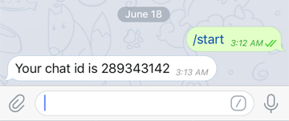
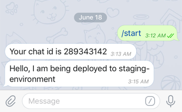

# Telegram-bot-notifier
Telegram Bot Notifier allows you to be notified of certain changes within your environment through Telegram. It is a bot which can send you notifications/messages. I use this in my CI/CD pipeline to let me know which stage the build process is at.

# Usage
For more details on how to use it, look at the folder - example.

## 1. Set up a telegram bot

This bot will be the one pushing you notifications on your environment.

Start by searching for the `BotFather` in Telegram and start a chat by typing in `/newbot`.

{:width="50%"}

The BotFather will guide you through the steps of setting up your own bot by giving it a name (or add a profile picture etc). Once done, you will be given a **HTTP API token** for your bot. 

## 2. Find out your Telegram chat ID

`npm install telegram-bot-notifier --save` and require the module in your root server.js file. 

`TelegramBotNotifier.getChatId(APP, HTTP_API_TOKEN)` 

```
const TelegramBotNotifier = require('telegram-bot-notifier');
TelegramBotNotifier.getChatId(app, TelegramConfig.BOT_TOKEN);

```
Start your server and navigate to the port you are on with the endpoint `/getChatId`. For e.g., `localhost:1338/getChatId`. 

Then talk to your bot on Telegram. The bot should respond with `Your chat id is XXXXX`. 



## 3. Make your bot send you notifications!
Save your Chat Id in your configuration file as we will need the Id to send notifications. 

To send notifications, we simply call  `TelegramBotNotifier.notify.sendMessage(MESSAGE, HTTP_API_TOKEN, ChatId) `, passing in the message, the HTTP API token from the BotFather and the Chat Id from the previous step. 
```
TelegramBotNotifier.notify.sendMessage('Hello, I am being deployed to staging-environment', TelegramConfig.BOT_TOKEN, TelegramConfig.CHAT_ID);
```




